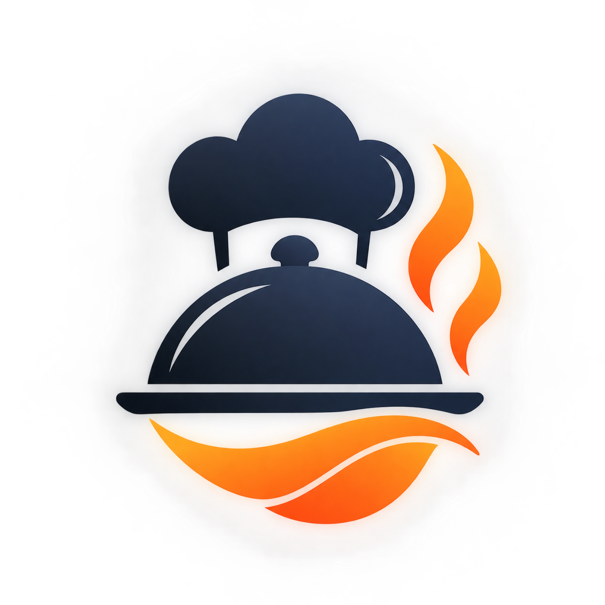

# 🎯 CaféFlow - Автоматизация кафе и ресторанов

<div align="center">



**Современная white-label платформа для управления кафе, ресторанами и заведениями общественного питания**

[](https://nextjs.org/)
[](https://www.typescriptlang.org/)
[](https://tailwindcss.com/)
[](https://www.prisma.io/)

[🚀 Демо](http://localhost:3000/ru) • [📖 Документация](./LANDING.md) • [🌍 Мультиязычность](#-мультиязычность)

</div>

---

## 📋 О проекте

**CaféFlow** — тиражируемая веб-система для автоматизации основных процессов заведений общественного питания. Продукт создан как коммерческое white-label решение, которое можно развернуть для любого кафе, ресторана, кофейни или пекарни с минимальной настройкой.

### 🎯 Ключевые возможности

- 📱 **Онлайн-меню и заказы** - QR-коды, модификаторы, корзина
- 🍽️ **Бронирование столиков** - автоматическая система с защитой от конфликтов
- 👨‍🍳 **Модуль для кухни** - цифровой экран заказов с статусами
- 🎁 **Программа лояльности** - бонусы, промокоды, история
- 📊 **Аналитика** - детальная статистика продаж и выручки
- ⚙️ **Админ-панель** - управление меню, персоналом, клиентами

### 🏗️ Архитектура

- **Multi-tenant** - один код для всех заведений
- **White-label** - полная брендированность под клиента
- **Модульная** - подключение только нужных функций
- **Масштабируемая** - готова к росту

---

## 🚀 Быстрый старт

### Требования

- Node.js 20+
- PostgreSQL 14+
- npm или yarn

### Установка

```bash
# Клонировать репозиторий
git clone https://github.com/your-org/cafeflow.git
cd cafeflow

# Установить зависимости
npm install

# Настроить переменные окружения
cp .env.example .env
# Отредактировать .env с вашими параметрами

# Запустить миграции базы данных
npx prisma migrate dev

# Запустить в режиме разработки
npm run dev
```

Откройте [http://localhost:3000/ru](http://localhost:3000/ru) в браузере.

---

## 🌍 Мультиязычность

Проект полностью поддерживает несколько языков:

- 🇷🇺 **Русский** (ru) - основной язык
- 🇰🇬 **Кыргызский** (kg) - полная локализация

**URL структура:**
```
/ru        - Русская версия лендинга
/kg        - Кыргызская версия лендинга
```

**Добавление нового языка:**
1. Добавить код языка в `src/app/i18n/config.ts`
2. Создать папку `src/app/i18n/locales/[код]/`
3. Скопировать и перевести `common.json` и `landing.json`

---

## 📂 Структура проекта

```
cafeflow/
├── prisma/
│   └── schema.prisma          # Схема базы данных (26 таблиц)
├── public/
│   └── Logo-CafeFlow.png      # Лого проекта
├── src/
│   ├── app/
│   │   ├── [locale]/
│   │   │   ├── page.tsx       # Лендинг страница
│   │   │   └── layout.tsx     # Layout с i18n
│   │   ├── i18n/              # Система интернационализации
│   │   │   ├── config.ts
│   │   │   ├── utils.ts
│   │   │   └── locales/
│   │   │       ├── ru/
│   │   │       └── kg/
│   │   ├── globals.css        # Глобальные стили
│   │   └── not-found.tsx      # 404 страница
│   └── components/
│       ├── Header.tsx         # Хедер с навигацией
│       ├── LanguageSwitcher.tsx
│       └── landing/           # Компоненты лендинга (9 штук)
├── docs/
│   ├── TZ-CafeFlow.md         # Техническое задание
│   ├── CafeFlow_BD.md         # Описание БД
│   └── Archetype.excalidraw   # Прототип интерфейса
├── LANDING.md                 # Документация лендинга
├── LANDING_SUMMARY.md         # Краткий обзор
└── scripts/
    └── landing-info.md        # Практическое руководство
```

---

## 🎨 Лендинг страница

### Секции

1. **Hero** - Главная секция с value proposition
2. **Problems** - Боли целевой аудитории
3. **Features** - 6 ключевых возможностей
4. **Benefits** - Преимущества решения
5. **Audience** - Для кого продукт
6. **Tech** - Технологический стек
7. **CTA** - Призыв к действию + форма
8. **Footer** - Навигация и контакты

### Дизайн

- ✅ Адаптивный (mobile, tablet, desktop)
- ✅ Темная и светлая тема
- ✅ Современные градиенты и анимации
- ✅ Профессиональный UI/UX

**Подробнее:** [LANDING.md](./LANDING.md)

---

## 🗄️ База данных

### Схема

26 таблиц, покрывающих все аспекты работы заведения:

- **Заведения**: tenants, branches
- **Пользователи**: users, roles, permissions
- **Меню**: menu_categories, products, modifiers
- **Заказы**: orders, order_items, carts
- **Доставка**: delivery_zones, order_deliveries
- **Бронирования**: reservations, restaurant_tables
- **Лояльность**: loyalty, promotions
- **Аналитика**: analytics_daily, reviews
- **Контент**: content, business_hours

**Подробнее:** [CafeFlow_BD.md](./CafeFlow_BD.md)

---

## 🛠️ Технологический стек

### Frontend
- **Next.js 16.3** - React framework с App Router
- **TypeScript** - Статическая типизация
- **Tailwind CSS 4** - Utility-first CSS
- **Geist Font** - Современная типографика

### Backend
- **Prisma 7.10** - ORM для PostgreSQL
- **PostgreSQL** - Основная база данных
- **Node.js** - Runtime

### Инфраструктура
- **Docker** - Контейнеризация
- **Vercel** - Рекомендуемый хостинг
- **S3-compatible storage** - Для файлов

---

## 📜 Скрипты

```bash
# Разработка
npm run dev              # Запуск dev сервера

# Production
npm run build            # Сборка для production
npm start                # Запуск production сервера

# База данных
npx prisma migrate dev   # Создать миграцию
npx prisma generate      # Генерация Prisma Client
npx prisma studio        # Открыть Prisma Studio
npx prisma db push       # Синхронизация с БД

# Код
npm run lint             # Проверка ESLint
```

---

## 📖 Документация

- [📋 Техническое задание](./TZ-CafeFlow.md) - Полное ТЗ проекта
- [🗄️ База данных](./CafeFlow_BD.md) - Описание схемы БД
- [🎨 Лендинг](./LANDING.md) - Документация landing page
- [📝 Quick Guide](./scripts/landing-info.md) - Практическое руководство
- [✨ Summary](./LANDING_SUMMARY.md) - Краткий обзор

---

## 🎯 Целевая аудитория

### Конечные пользователи
- Владельцы кафе и ресторанов
- Управляющие заведениями
- Сотрудники (официанты, кухня, кассиры)
- Клиенты заведений

### Покупатели продукта
- Небольшие кафе и кофейни
- Рестораны
- Пекарни и кондитерские
- Заведения с доставкой

---

## 🚀 Деплой

### Vercel (рекомендуется)

```bash
npm i -g vercel
vercel
```

### Docker

```bash
docker build -t cafeflow .
docker run -p 3000:3000 cafeflow
```

### Manual

```bash
npm run build
npm start
```

---

## 🔐 Безопасность

- ✅ HTTPS обязателен в production
- ✅ Хеширование паролей (bcrypt)
- ✅ SQL инъекции (Prisma защита)
- ✅ XSS защита
- ✅ CSRF токены
- ✅ RBAC (Role-Based Access Control)
- ✅ Валидация на клиенте и сервере

---

## 📊 Роадмап

### MVP (Текущая версия) ✅
- [x] Landing page (ru, kg)
- [x] База данных (schema)
- [x] Документация
- [ ] Админ-панель
- [ ] Клиентское приложение
- [ ] API endpoints

### v1.0 (Ближайшие)
- [ ] Онлайн-заказы
- [ ] Бронирования
- [ ] Модуль кухни
- [ ] Базовая аналитика
- [ ] Email уведомления

### v2.0 (Будущее)
- [ ] Мобильное приложение
- [ ] AI рекомендации
- [ ] Telegram Bot
- [ ] Платежные системы
- [ ] Расширенная аналитика

---

## 🤝 Вклад в проект

Мы приветствуем вклад в развитие проекта! Пожалуйста:

1. Fork репозитория
2. Создайте feature branch (`git checkout -b feature/AmazingFeature`)
3. Commit изменения (`git commit -m 'Add some AmazingFeature'`)
4. Push в branch (`git push origin feature/AmazingFeature`)
5. Откройте Pull Request

---

## 📄 Лицензия

Этот проект является коммерческим продуктом. Все права защищены.

---

## 📞 Контакты

- **Email**: info@cafeflow.com
- **Website**: [cafeflow.com](https://cafeflow.com)
- **Telegram**: [@cafeflow_support](https://t.me/cafeflow_support)

---

<div align="center">

**Сделано с ❤️ командой CaféFlow**

[⬆ Наверх](#-caféflow---автоматизация-кафе-и-ресторанов)

</div>
